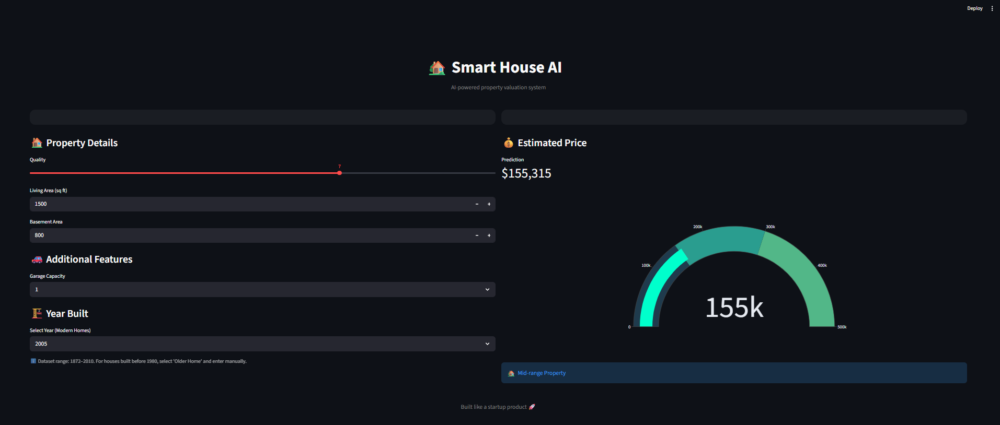

# 🏡 Smart House AI

A House Price Prediction system built using Python, Streamlit, and Machine Learning.

## Features

- House price prediction using Random Forest Regression
- Interactive Streamlit dashboard
- Real-time price prediction
- Price gauge meter visualization
- Property category classification
- Modern and responsive UI

## Technologies Used

- Python
- Pandas
- NumPy
- Scikit-learn
- Streamlit
- Plotly

## Dataset

Ames Housing Dataset

## Model Performance

| Model | R² Score |
|---------|---------|
| Linear Regression | 0.766 |
| Random Forest | 0.883 |
| Tuned Random Forest | 0.884 |

## Run Locally

```bash
pip install -r requirements.txt
streamlit run app.py
```
## Live Demo

[Click Here to Open App](https://house-price-prediction-ml-di5glpyysbnfbgb5dj4y33.streamlit.app/)

## Screenshots



## Author

Bilal
